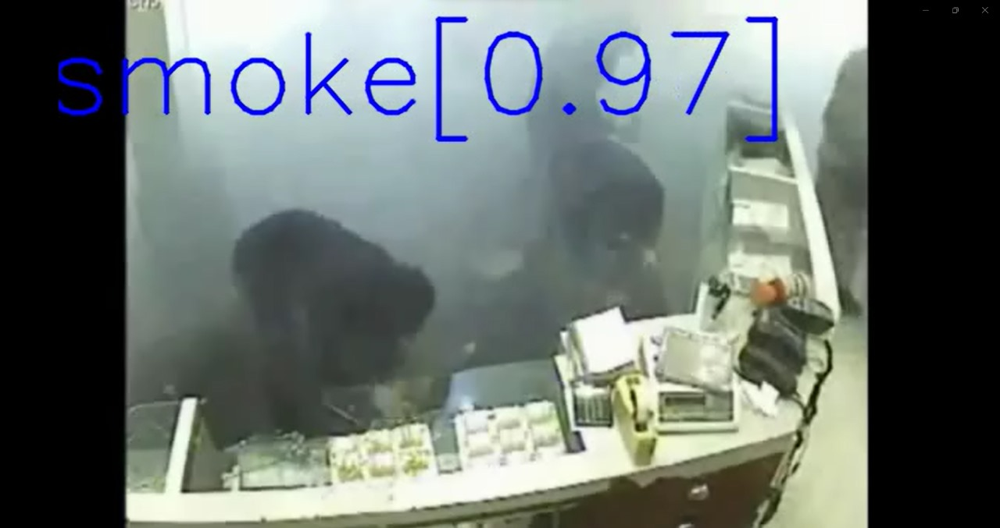
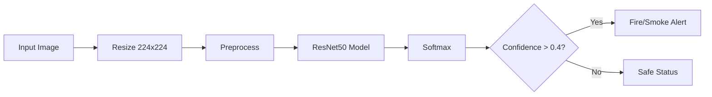

<div align="center">

# 🔥 SecureVision

### Intelligent Fire & Smoke Detection powered by Deep Learning

[](https://python.org)
[](https://tensorflow.org)
[](https://streamlit.io)
[](LICENSE)

<p align="center">
  
</p>

**Real-time fire and smoke detection to protect lives and property.**

[Features](#-features) • [Quick Start](#-quick-start) • [Installation](#-installation) • [Usage](#-usage) • [Architecture](#-architecture) • [Contributing](#-contributing)

</div>

---

## 🎯 Features

<table>
<tr>
<td width="33%">

### 📹 Real-time Detection
Advanced computer vision analyzes webcam feeds to detect fire and smoke in real-time.

</td>
<td width="33%">

### 🔔 Instant Alerts
Audio and visual warnings notify you immediately when danger is detected.

</td>
<td width="33%">

### 🖼️ Image Analysis
Upload images for quick fire/smoke analysis with detailed confidence scores.

</td>
</tr>
<tr>
<td width="33%">

### 🧠 AI Powered
Built on ResNet50 architecture, trained on thousands of fire and smoke images.

</td>
<td width="33%">

### 📱 Modern UI
Beautiful, responsive interface with dark mode and intuitive navigation.

</td>
<td width="33%">

### 🛡️ Safety Guide
Built-in fire safety tips and emergency information.

</td>
</tr>
</table>


---

## 📦 Installation

### Prerequisites

- Python 3.8 or higher
- pip (Python package manager)
- Webcam (for live detection)

### Step-by-Step Setup

1. **Clone the repository**
   ```bash
   git clone https://github.com/Pranav-P-S/SecureVision.git
   cd SecureVision
   ```

2. **Create a virtual environment** (recommended)
   ```bash
   python -m venv venv
   
   # Windows
   venv\Scripts\activate
   
   # macOS/Linux
   source venv/bin/activate
   ```

3. **Install dependencies**
   ```bash
   pip install -r requirements.txt
   ```

4. **Verify model file exists**
   ```
   models/trained_model_l.h5
   ```
   > **Note:** The pre-trained model (~95MB) should be included in the repository. If missing, download it separately.

5. **Run the application**
   ```bash
   streamlit run app.py
   ```
The app will open in your browser at `http://localhost:8501`

---

## 💻 Usage

### Home Page
Browse fire safety information and emergency guidelines.

### Live Detection
1. Navigate to **📹 Live Detection** in the sidebar
2. Allow camera access when prompted
3. Click "Capture" to analyze frames
4. Adjust confidence threshold as needed
5. Enable/disable audio alerts

### Image Upload
1. Navigate to **🖼️ Image Upload**
2. Drag & drop or browse for an image
3. View detection results with confidence scores

---

## 🏗️ Architecture

### Project Structure

```
SecureVision/
├── 📄 app.py                 # Main Streamlit application
├── ⚙️ config.py              # Configuration settings
├── 📋 requirements.txt       # Python dependencies
├── 📖 README.md              # Documentation
│
├── 🧠 models/
│   └── trained_model_l.h5    # Pre-trained ResNet50 model
│
├── 🛠️ utils/
│   ├── __init__.py
│   └── detection.py          # Detection utilities
│
├── 📁 data/
│   ├── main.py               # Training script
│   └── *.avi                 # Test videos
│
└── 🐳 .devcontainer/
    └── devcontainer.json     # Dev container config
```

### Model Details

| Property | Value |
|----------|-------|
| **Architecture** | ResNet50 (Transfer Learning) |
| **Input Size** | 224 × 224 × 3 |
| **Classes** | 3 (Safe, Fire, Smoke) |
| **Framework** | TensorFlow/Keras |
| **Pre-trained On** | ImageNet |

### Detection Pipeline



---

## 🛠️ Tech Stack

| Technology | Purpose |
|------------|---------|
| **TensorFlow/Keras** | Deep learning model |
| **OpenCV** | Image processing |
| **Streamlit** | Web interface |
| **NumPy** | Numerical computing |
| **Pillow** | Image handling |

---

## 🧪 Training

The model was trained using transfer learning on ResNet50:

```python
# Training configuration (from data/main.py)
IMG_SIZE = 224
NUM_EPOCHS = 20
TRAIN_BATCH_SIZE = 77
NUM_CLASSES = 3
```

Data augmentation includes:
- Width/height shifts (10%)
- Zoom (0.9-1.25x)
- Horizontal flip
- Brightness variation (0.5-1.5x)

---

## 🆘 Emergency Numbers

| Service | Number (India) |
|---------|----------------|
| 🚒 Fire Department | **101** |
| 🚔 Police | **100** |
| 🚑 Ambulance | **102** |

---

## 🤝 Contributing

Contributions are welcome! Here's how you can help:

1. **Fork** the repository
2. **Create** a feature branch (`git checkout -b feature/AmazingFeature`)
3. **Commit** your changes (`git commit -m 'Add AmazingFeature'`)
4. **Push** to the branch (`git push origin feature/AmazingFeature`)
5. **Open** a Pull Request

### Ideas for Contribution
- [ ] Add support for video file analysis
- [ ] Implement notification system (email/SMS)
- [ ] Add multi-language support
- [ ] Improve model accuracy
- [ ] Add night vision detection

---

## 📄 License

This project is licensed under the MIT License - see the [LICENSE](LICENSE) file for details.

---

## 🙏 Acknowledgments

- [TensorFlow Team](https://www.tensorflow.org/) for the deep learning framework
- [Streamlit](https://streamlit.io/) for the amazing web framework
- [ImageNet](https://www.image-net.org/) for pre-trained weights
- Fire safety guidelines from [Virginia Tech Emergency Management](https://emergency.vt.edu/)

---

<div align="center">

**Made with ❤️ for safety**

⭐ Star this repo if you find it useful!

</div>
